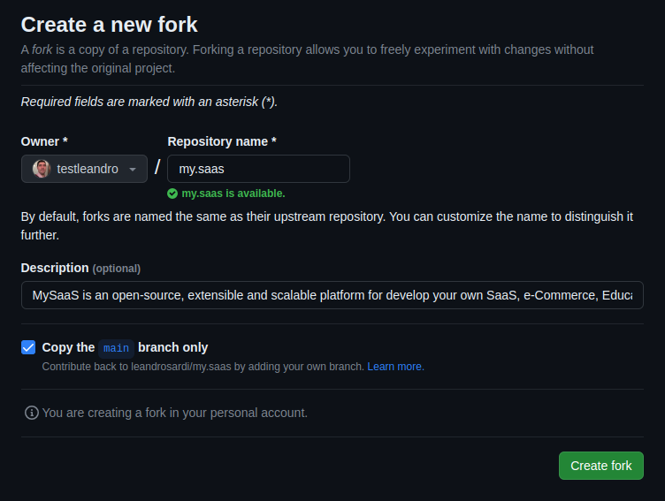

   


# MySaaS - Open Source SaaS Platform - Extensible and Scalable.  

**MySaaS** is an open-source, extensible and scalable platform for develop your own SaaS, e-Commerce, Education Platform, Social Network, Forum or any kind of memberships based product.


## 01. Features

Here is a full list of the MySaaS features:

**Fast Front-End Coding**

- :heavy_check_mark: Vast pool of JavaScript components for an imporved UX.
- :heavy_check_mark: Vast pool of CSS entities for a nice UI.
- :heavy_check_mark: Funnel configuration with JSON descriptors.

**Deployment Automation:**

- :heavy_check_mark: Automated installation CLI command.
- :heavy_check_mark: Automated deployment CLI command.
- :heavy_check_mark: Automated backing up and restoring of secret files that you can't store in repositories  ([DropBox](https://www.dropbox.com)).

**Scalability**

- :heavy_check_mark: Infrasctructure as a Code (IaaC) capabilities for running a mesh of offline processes.
- :heavy_check_mark: Scalable architecture: 
	- [AWS EC2](https://aws.amazon.com/ec2/) for scaleble webservers;
	- [Dropbox API](https://aws.amazon.com/ebs/) for elastic storage; and 
	- [CockroachDB](https://www.cockroachlabs.com/) for scalable and serverless database.

**End-Users Management**

- :heavy_check_mark: Transactional emails ([Postmark](https://postmarkapp.com/)).
- :heavy_check_mark: PayPal integration for Invoicing & Payments Processing ([I2P](https://github.com/leandrosardi/i2p)).

**Extensibility**

- :heavy_check_mark: Easy modules development.
- :heavy_check_mark: Advanced JavaScript components:
	- [Filters.js](https://github.com/leandrosardi/filtersjs);
	- [Templates.js](https://github.com/leandrosardi/templatesjs); 
	- [Editables.js](https://github.com/leandrosardi/editablesjs); 
	- [Timelines.js](https://github.com/leandrosardi/templatesjs); 
	- [Progress.js](https://github.com/leandrosardi/progressjs);
	- [Lists.js](https://github.com/leandrosardi/listsjs); and
	- [Datas.js](https://github.com/leandrosardi/datasjs).

## 02. Installation

### 02.1. Setup Environment

MySaaS has been developed and tested on the following environment:
- Ubuntu 20.04
- Ruby 3.1.2
- Bundler 2.3.7

The command below install such an environment in your computer.

```bash
wget https://raw.githubusercontent.com/leandrosardi/my.saas/main/cli/install.sh
bash install.sh
```

### 02.2. Fork MySaaS

Create your own repository, using this one as a template.

1. Access your GitHub account, and click on "Create fork".

2. Go [here](https://github.com/leandrosardi/my.saas/fork) to fork this repository.



3. Clone the project in your computer.

```bash
mkdir ~/code
cd ~/code
git clone https://github.com/<your github user>/my.saas
```

4. Install requrired gems

```bash
cd ~/code/my.saas
bundler update
```

### 02.2. Database Installation

MySaaS runs on CockroachDB. 

Here are the instructions for installing the database in either: development or production environments:

- For creating a database for development in your local computer, refer to this [tutorial](https://www.cockroachlabs.com/docs/stable/install-cockroachdb-linux) to install CockroachDB locally.

Then run it as stand-alone with the command below:

```bash
cockroach start-single-node --insecure
```

- For creating cloud and serverless database for production, refer to [this tutorial](./docu/01.Installing-crdb.md) for:

	1. Creating your free-tier CockroachDB instance;
	2. Setting up your connection on `config.rb`; and
	3. Deploying all database migrations.

### 02.3. Configuration File

First, you need a configuration file:

```bash
cd ~/code/my.saas
cp ./config.template.rb ./config.rb
```

In such a configuration file, your database connection parameters:

```ruby
BlackStack::CRDB::set_db_params({ 
  :db_url => 'free-tier14.aws-us-east-1.cockroachlabs.cloud',
  :db_port => '26257', 
  :db_cluster => 'blackstack-4545', # this parameter is optional. Use this when using CRDB serverless.
  :db_name => 'blackstack', 
  :db_user => 'blackstack', 
  :db_password => '(write your db password here)',
})
```

### 02.4. Running Webserver

After you have MySaaS configured to connect to CockroachDB, and all the database migrations installed, you can put your SaaS online.

Before running the `app` command, you need to edit the environment variable `$RUBYLIB`.

```bash
export RUBYLIB=~/code/my.saas
```

Then, you are good to run your app.

```bash
cd ~/code/my.saas/
ruby app.rb
```


Now, you go to [https://127.0.0.1:3000](https://127.0.0.1:3000) and access the platform account with the default credentials for the **system owner**:
- email: su
- password: Testing123


If you want to use another file different than `config.rb`, use the `config` parameter.

```bash
cd ~/code/my.saas/cli
ruby start.rb config=my_config
```

If you want to use another port different than `3000`, use the `port` parameter.

```bash
cd ~/code/my.saas/cli
ruby start.rb port=8080
```

## 03. Sandbox Mode

Create a file `.sandbox` to set the function `BlackStack.sandbox?=true` when you start the webserver.

```bash
cd ~/code/my.saas
touch .sandbox
```

The `BlackStack.sandbox?` function is used in the `config.rb` file mainly, to switch configuration between `development` or `production` environment.

E.g.: You may want to switch between `development` and `production` databases without have to move files or writing code. Just keep the `.sandbox` file in your local computer for development.

## 04. System Owner

_(pending to write documentation)_
- Changing the API-Key of the System Owner.
- Updating the configuration file.

## 05. Elastic Storage

_(pending to write documentation: using dropbox as an elastic storage service)_

## 06. Secret Files Management

Every project has information that you don't want to push to the repository.

E.g.:
- passwords,
- ssl certificates. 

MySaaS connects to [DropBox](https://www.dropbox.com/developers/reference/developer-guide) for automated backup and restoration of secret files.

[In this tutorial, it's explained how to connect MySaaS to Dropbox for running and restore backups](./docu/02.secret-files-management.md). 

## 07. Deployment Automation

- [deploy.rb](#deployrb)
- [automated deploying](./docu/13.automated-deploying.md) for **continious deployment** of your software;

## 08. Transactional Emails

_(pending to write documentation)_

## 09. Invoicing and Payments Processing

_(pending to write documentation)_

## 10. Accounts Management

_(pending to write documentation)_

## 10. Scalable Backend Processing

_(pending to write documentation)_

## 11. Access Points Publishing

_(pending to write documentation)_

## 12. Extensibility

An extension is a folder structure that is appended to the **MySaaS** platform.

**Example:**

```ruby
BlackStack::Extensions::appened :helpdesk
# this line will append all the subfolders into ~/code/my.saas/extensions/helpdesk to the project (screens, claseses, javascripts, css, etc.)
```

Each extension can provide new database tables, new screens, API end-points, javascript or css files; and even more custom storage folders, back-end processes or its own paid plans.

Find the full documentation [here](./docu/16.extensibility.md).

## 13. Code Examples

_(pending to write documentation)_

1. Screens Rendering
2. Filters
3. Access Points

Find the full documentation [here](./docu/17.code-examples.md).

## 14. Advanced JavaScript Components

_(pending to write documentation)_

1. SelectRows.js
2. Filters.js
3. Progress.js
4. Templates.js
5. Editables.js
6. Tables.js

## 15. Official Extensions

_(pending to write documentation)_

1. Invoicing and Payments Processing
2. Monitoring
3. Content
4. Affiliates Tracking
5. Emails
6. HelpDesk
7. Forums 

## 16. Further Work

1. affiliates tracking, for managing resellers and pay commission;

2. domain aliasing, for licencing your site to other companies;

3. abuse preventing, by tracking user's network and browser fingertings;

4. shadow profiling [[1](https://en.wikipedia.org/wiki/Shadow_profile)], for sales optimizations and client retention;

5. Affiliates Tracking Extension

6. White-Labeling Features

7. Custom Alerts

8. Screens As a Code

9. Improve Funnel Configuration
	- add descriptor about the email marketing automation
	- add descriptor about which transactional emails activate for this funnel
	- add A/B testing of screens (landing, offer, plans, etc)
