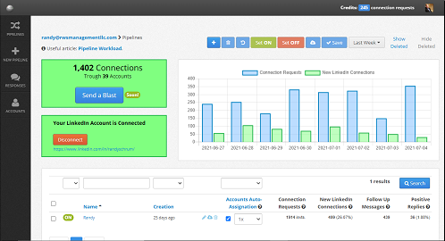

## IMPORTANT: THIS FRAMEWORK IS STILL UNDER CONSTRUCTION

---


   


## Brainstorming Documentation Outline

- Installation
- Visitors tracking - Download/update `GeoLite2-City.mmdb` (https://github.com/P3TERX/GeoLite.mmdb)
- Extensibility
- UI Components - tags, lists, etc.
- API Calls, API Calls Tracking and API Calls Quota
- Monitoring Extensions: Super-User, monitoring, accessing other people accounts
- Invoicing and Payments Processing
- Content Management System
- Transactional emails
- Asyncronius processing
- Domain aliasing & `account.id_user_owner` field.
- Affiliates tracking & `account.id_user_referral` field.

## Getting Started

[MassProspecting](https://github.com/leandrosardi/my.saas) uses [BlackOps](https://github.com/leandrosardi/blackops) for installaton and continious deployment.

### Installation

1. First thing first, [download the `saas` command in your computer](https://github.com/leandrosardi/blackops?tab=readme-ov-file#11-download-the-saas-command).

2. Download pre-built **operations**.

```
mkdir -p ~/code1
cd ~/code1
git clone https://github.com/leandrosardi/blackops
```

3. Install My.SaaS

```
saas source ~/code1/blackops/ops/mysaas.install.ubuntu_22_04.base.op \
    --local 
    --ssh_username= && \

saas source ~/code1/blackops/ops/mysaas.install.ubuntu_22_04.postgresql.op 
    --local
    --ssh_username= && \

saas migrations
```

---

# MySaaS - Open Source SaaS Platform - Extensible and Scalable.  

**MySaaS** is an open-source, extensible and scalable platform for develop your own Software as a Service (SaaS), e-Commerce, Education Platform, Social Network, Forum or any kind of memberships based product.



## Getting Started

1. On Ubuntu 20.04, download the script for installing our **standard environment**:

```
wget https://raw.githubusercontent.com/leandrosardi/environment/main/sh/install.ubuntu.20_04.sh
```

2. Install **my.saas**:

Switch to `root` and run this command:

```
bash install.ubuntu.20_04.sh <hostname> <password>
```

- A new user `blackstack` will be added to your operative system, with the password provided in the command line.

- The `hostname` of your computer will be changed too.

3. Switch user to `blackstack`.

4. Install and run your first SaaS:

```
saas deploy ssh=blackstack@<password>@localhost:22
```

The following (and very simple architecture) has been installed in your computer:

_(image)_

5. Visit your SaaS at [http://127.0.0.1:3000](http://127.0.0.1:3000).


Recommended readings:

- [References Architectures](/docu/00.reference-architectures.md).

- [Command Line Interface](/docu/00.command-line-interface.md).

---

## IMPORTANT: THIS FRAMEWORK IS STILL UNDER CONSTRUCTION

