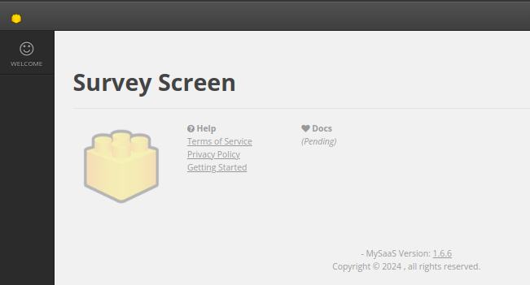

   


# MySaaS - Open Source SaaS Platform - Extensible and Scalable.  

**MySaaS** is an open-source, extensible and scalable platform for develop your own Software as a Service (SaaS), e-Commerce, Education Platform, Social Network, Forum or any kind of memberships based product.


**Outline:**

1. [Features](#1-features)
2. [Getting Started](#2-getting-started)
3. [Running Scripts](#3-running-scripts)
4. [Models](#4-models)
5. [Screens](#5-screens)
6. [Filters](#6-filers)
7. [Access Points](#7-access-points)
8. [Reactive Elements](#8-reactive-elements)
9. [Extensions](#9-extensions)

Configuration

- changing deloyment output file
- changing `MYSAAS_API_KEY`
- setting `DROPBOX_REFRESH_TOKEN`

## 1. Features

Here is a full list of the MySaaS features:

**Fast Front-End Coding:**

- :heavy_check_mark: Vast pool of JavaScript components for an imporved UX.
- :heavy_check_mark: Vast pool of CSS entities for a nice UI.
- :heavy_check_mark: Funnel configuration with JSON descriptors.

**Deployment Automation:**

- :heavy_check_mark: Automated installation CLI command.
- :heavy_check_mark: Automated deployment CLI command.
- :heavy_check_mark: Automated backing up and restoring of secret files that you can't store in repositories  ([DropBox](https://www.dropbox.com)).

**Scalability:**

- :heavy_check_mark: Infrasctructure as a Code (IaaC) capabilities for running a mesh of offline processes.
- :heavy_check_mark: Scalable architecture: 
	- [AWS EC2](https://aws.amazon.com/ec2/) for scaleble webservers;
	- [Dropbox API](https://aws.amazon.com/ebs/) for elastic storage; and 
	- [CockroachDB](https://www.cockroachlabs.com/) for scalable and serverless database.

**End-Users Management:**

- :heavy_check_mark: Transactional emails ([Postmark](https://postmarkapp.com/)).
- :heavy_check_mark: PayPal integration for Invoicing & Payments Processing ([I2P](https://github.com/leandrosardi/i2p)).

**Extensibility:**

- :heavy_check_mark: Easy modules development.
- :heavy_check_mark: Advanced JavaScript components:
	- [Filters.js](https://github.com/leandrosardi/filtersjs);
	- [Templates.js](https://github.com/leandrosardi/templatesjs); 
	- [Editables.js](https://github.com/leandrosardi/editablesjs); 
	- [Timelines.js](https://github.com/leandrosardi/templatesjs); 
	- [Progress.js](https://github.com/leandrosardi/progressjs);
	- [Lists.js](https://github.com/leandrosardi/listsjs); and
	- [Datas.js](https://github.com/leandrosardi/datasjs).

## 2. Getting Started

On a fresh installation of Ubuntu 20.04, and using the `root` user, run the commands below:

**Step 1:** Run the **Environment Installation Script**.

Download our Environment Installation Script (or simply EIS) by running the lines below:

```
cd ~
wget https://raw.githubusercontent.com/leandrosardi/environment/main/sh/install.ubuntu.20_04.sh
```

Then run the EIS by running the line below, replacing the merge-tags

- `<hostname>` with the name you have to assisng the the node where my.saas will run; and
- `<password>` with the password you want for a new Linux user called `blackstack` who will be created by the EIS.

```
bash install.ubuntu.20_04.sh <hostname> <password>
```

**Note:** For running this example, use the values `dev2` and `blackstack123`. E.g.:

```
bash install.ubuntu.20_04.sh dev2 blackstack123
```

**Note:** Refer to [this other repository](https://github.com/leandrosardi/environment) for more information about the Environment Installation Script.

**Step 2:** Switch from `root` to the new `blackstack` user.

```bash
sudo su - blackstack
```

**Step 3:** Clone my.saas.

```bash
mkdir ~/code
cd ~/code
git clone https://github.com/leandrosardi/my.saas
```

```bash
cd ~/code/my.saas
git switch dev-1.6.7
git fetch --all
git reset --hard origin/dev-1.6.7
```

**Step 4:** Update gems.

```bash
cd ~/code/my.saas
bundler update
```

**Step 5:** Create a configuration file.

```bash
cd ~/code/my.saas
mv config.template.rb config.rb
```

**Step 6:** Deploy my.saas.

```bash
export RUBYLIB=~/code/my.saas
cd ~/code/my.saas/cli
ruby deploy.rb
```

Now, you can navigatoe the my.saas website from the host browser:

[http://127.0.0.1:3000/login](http://127.0.0.1:3000/login)


You can login using the default credentials:
- user: `su`
- password: `Testing123` 

If the website is not working, you can check the file `~/deployment.log` in the server node.

## 3. Running Scripts

Every time you want to run a Ruby script using the my.saas framework, you have to set the environment variable `RUBYLIB` properly.

```bash
export RUBYLIB=/home/blackstcack/code/my.saas
```

E.g.: This [signup example](./examples/signup.rb) registers a new account in the database.

```bash
export RUBYLIB=/home/blackstcack/code/my.saas
cd $RUBYLIB/examples
ruby signup.rb
```

Every new script must looks like below:

```ruby
# load gems and connect database
require 'mysaas'
require 'lib/stubs'
require 'config'
require 'version'
DB = BlackStack.db_connect
require 'lib/skeletons'

# create a new l
l = BlackStack::LocalLogger.new('<your-script-name-here>.log')

begin
    l.logs 'Starting the process... '
	
	# TODO: Add your code here.

    l.logf 'done'.green

# catch the case when the process is interrupted
rescue Interrupt => e
    l.logf e.message.red
    l.logf e.backtrace.join("\n")

# catch the case when an exception is raised
rescue Exception => e
    l.logf e.message.red
    l.logf e.backtrace.join("\n")

# ensure releasing of resources and the execution of any other mandatory code
ensure
    GC.start
    DB.disconnect

    # TODO: add any other mandatory code here.

    l.log 'process finished'.green
end
```

## 4. Models

The folder [sql](./sql/) contains the database schema and the seed data for running my.saas. Read the files into the folder [sql](./sql/) and get familiarized with them.

The folder [models/skeleton](./models/skeleton/) has [Sequel](https://sequel.jeremyevans.net/) defined clases to manage objects that persist in the database. 

Any **persistance class** should inherit from `Sequel::Model`.

E.g.:

```ruby
class Account < Sequel::Model(:account)

	# class attributes and method are here
	
end # class Account 
```

Any **persistance class** must be contained into the **project module** that you are working on (e.g.: `MySaaSFork`). Such a module must be contained into the `BlackStack` module too.

If you don't know the name of the **project module**, ask it to @leandrosardi.

E.g.:

```ruby
module BlackStack
  module <name of the project module>
    class Account < Sequel::Model(:account)

		# class attributes and method are here
	
	end # class Account
  end # module <name of the project module>
end # module BlackStack
```

Any **persistance class** must have an array to all other **persistance classes** with a foreing key to it.

E.g.:

```ruby
module BlackStack
  module <name of the project module>
    class Account < Sequel::Model(:account)
        one_to_many :users, :class=>:'BlackStack::MySaaS::User', :key=>:id_account
	
	end # class Account
  end # module <name of the project module>
end # module BlackStack
```

Any **persistance class** must have an attribute to any **persistance class** that it has a foreing key to.

E.g.:

```ruby
module BlackStack
  module <name of the project module>
    class Account < Sequel::Model(:account)
        many_to_one :timezone, :class=>:'BlackStack::MySaaS::Timezone', :key=>:id_timezone
	
	end # class Account
  end # module <name of the project module>
end # module BlackStack
```

**Creating Objects:**

Use the function `guid` if you need a **Globally Unique ID** (or simply **GUID**) for creating a new persistance object.

Use the function `now` if you need the current timestamp.
The function `now` returns the current timestamp at GTM-3 (Buenos Aires date/time).

E.g.: The script below will register a new account in the database.

```ruby
# load gem and connect database
require 'mysaas'
require 'lib/stubs'
require 'config'
require 'version'
DB = BlackStack.db_connect
require 'lib/skeletons'

a = BlackStack::MySaaS::Account.new
a.id = guid
a.id_account_owner = BlackStack::MySaaS::Account.first.id
a.name = 'ACME LLC'
a.create_time = now
a.id_timezone = BlackStack::MySaaS::Timezone.first.id
a.save
```

**Extending the Model**

You can extend the database schema with new tables and define their persistance models too.

E.g.: You would want to register surveys from new users. Follow the steps below to add a new table called `survey`

1. Create a new file `a001.sql` into the folder [sql](./sql), and write this script inside:

```sql
CREATE TABLE IF NOT EXISTS public.survey (
	id uuid NOT NULL PRIMARY KEY,
  id_user uuid NOT NULL REFERENCES "user"("id"),
  id_timezone uuid NOT NULL REFERENCES "timezone"("id"),
  job_position VARCHAR(600) NOT NULL,
  company_headcount INT NOT NULL
);
```

**Note:** The table `survey` has a foreing key to the tables `user` and `timezone` that are already part if the database schma of my.saas.

**Note:** Name the file `a001.sql` if this is the first file you add into the folder [sql](./sql). If this is the second file you add, it should be `a002.sql`. When you add a new file into the [sql](./sql) filder you have to increase the number of the last file added.

2. Create a new file `survey.rb` into the folder [models/skeletons/core](./models/skeleton/core), and write this script inside:

```ruby
module BlackStack
  module <name of the project module>
    class Survey < Sequel::Model(:survey)

		  # add custom attributes and methods here
	
	  end 
  end
end
```

3. Add a line to require the file `survey.rb` from [lib/skeletons.rb](./lib/skeletons.rb), as shown below:

```ruby
require 'models/skeleton/core/survey'
```

4. Push the source code modifications to the git repository.

```bash
cd $RUBYLIB
git add *
git commit -m "adding a survey table"
git push
```

5. In order to run the migration file [a001.sql](./sql/a001.sql) and restart the webserver, run the script [deploy.rb](./cli/start.rb).

```bash
cd $RUBYLIB/cli
ruby deploy.rb
```

## 5. Screens

If you want to add a new screen, you have to modify the [app.rb](./app.rb) file.

E.g.: Follow the steps below to add a new "demo page" to your project.

1. add the lines below into the [app.rb](./app.rb) file:

```ruby
get '/demo' do
  "Deno Screen"
end
```

2. Restart the webserver by running the [start.rb](./cli/start.rb) script.

```bash
cd $RUBYLIB/cli
ruby start.rb
```


### 5.1. Layout of Public Pages

You can embeed your HTML code into the same frame used by the [login screen](./views/login.erb) seen before.

1. Save your HTML code into a new file into the [views](./views). In this example, it would be [views/demo.erb](./views/demo.erb).

```erb
Demo Screen
```

2. Write again the entry in the [app.rb](./app.rb) file.

```ruby
get '/demo' do
  erb :'views/demo', :layout => :'/views/layouts/public'
end
```

Remember to restart the webserver by running the [start.rb](./cli/start.rb) script.

```bash
cd $RUBYLIB/cli
ruby start.rb
```


### 5.2. Layout of Private Pages

The **private pages** are pages that require a login.

E.g.: Follow the steps below to a **survey screen** to show up every when a new user signup.

1. Save your HTML code into a new file into the [views](./views). In this example, it would be [views/survey.erb](./views/demo.erb).

```html
<h1>Survey Screen</h1>
```

2. Write again the entry in the [app.rb](./app.rb) file.

```ruby
get '/survey', :auth => true do
  erb :'views/survey', :layout => :'/views/layouts/core'
end
```

The `auth` condition will get the page forwarding to [login](./views/login.erb) if there are not any user logged in.

The `core` layout will embbed your HTML into a frame designed for private pages only.

Remember to restart the webserver by running the [start.rb](./cli/start.rb) script.

```bash
cd $RUBYLIB/cli
ruby start.rb
```



### 5.3. Navigation Bars

Add the code below at the top if the [/views/survey.erb](./views/survey.erb) screen, to add a 2-level navigation bar to your page.

```html
<div class="mynavbar2 mysticky">
    <div class="row-fluid">	
        <div class="span3">
            <%=nav1("Survey")%>
        </div>
    </div>
</div>
```

In your survey page, a 2-level navigation bar will look like this:

```
ACME LLC > Survey
```

where `ACME LLC` is the the value in the field `name` of the record in the `account` table, to which the logged in user is beloning to.


### 5.4. Top Buttons

Inside the `.mynavbar2` div, you can add a second child div to place buttons.

E.g.: The code below adds one blue button to submit the survey, and one gray button to skip the survey.

```html
<div class="mynavbar2 mysticky">
    <div class="row-fluid">	
        <div class="span3">
            <%=nav1("Survey")%>
        </div>
    </div>

    <div class="span9">
      <button class='btn btn-blue'>Submit</button>
      <a class='btn btn-gray' href='./'>Skip</a>
    </div>
</div>
```

**Note:** The second button is really a link to the dashboard.


### 5.5. ToolTips

Buttons may have nice tooltips too.

E.g.: The code below includes a tooltip to the submit button:

```html
<div class="mynavbar2 mysticky">
    <div class="row-fluid">	
        <div class="span3">
            <%=nav1("Survey")%>
        </div>
    </div>

    <div class="span9">
      <button class='btn btn-blue' title="Click here after you have filled all the fields of the survey.">Submit</button>
      <a class='btn btn-gray' href='./'>Skip</a>
    </div>
</div>
```


### 5.6. Input Boxes

You can add inputs too. 

E.g.: The code below includes an input box and a button to perform searches.

```html
<div class="mynavbar2 mysticky">
    <div class="row-fluid">	
        <div class="span3">
            <%=nav1("Survey")%>
        </div>
    </div>

    <div class="span9">
      <button class='btn btn-blue' title="Click here after you have filled all the fields of the survey.">Submit</button>
      <a class='btn btn-gray' href='./'>Skip</a>

      <input class="input input-large" id="q" name="q" value="">
      <button class="btn btn-blue" id="search"><i class="icon-search"></i></button>
    </div>
</div>
```


### 5.7. Dropdown Menus

In the same div where you placed buttons you can also add dropdown menus.

E.g.: The code below adds a list of tasks to perform by the user, in order to help the user to operate the software.

```html
<div class="mynavbar2 mysticky">
    <div class="row-fluid">	
        <div class="span3">
            <%=nav1("Survey")%>
        </div>

        <div class="span9">
            <button class='btn btn-blue'>Submit</button>
            <a class='btn btn-gray' href='./'>Skip</a>

            <div class="btn-group" style="vertical-align:top;">  
                <a id="tasks_list" name="tasks_list" class="btn dropdown-toggle" data-toggle="dropdown" href="#">
                    <b>Pending Tasks:</b> Complete the Survey <i class="icon-circle" style="color:gray;"></i> <span class="caret"></span>
                </a>
                <ul class="dropdown-menu">
                    <li>
                        <button class="btn btn-link" disabled=""><i class='icon-ok'></i> Signup</button>
                    </li>
                    <li>
                        <button class="btn btn-link" href='/survey'><i class='icon-time'></i> Complete the Survey</i></button>
                    </li>
                    <li>
                        <button class="btn btn-link" href='/settings/account'><i class='icon-time'></i> Setup Your TimeZone</i></button>
                    </li>                    
                </ul>
            </div>
        </div>
    </div>
</div>
```

**Note:** The first task in the list (signup) is already performed. The other 2 tasks are pending and include the `href` to there page where such a task should be performed.


### 5.8. Panels

Below the `.mynavbar2` div you would want to place forms, tables, charts, etc.

You may want to split the screen horizontally.

E.g.: You may want to place a table in the left panel, and show other stats in the right panel.


E.g.: In the survey screen, you a left panel to show a list of users who submited the survey, and a right panel to place the survey form.

```html
<!-- NavBar -->
<div class="mynavbar2 mysticky">
    <div class="row-fluid">	
        <div class="span3">
            <%=nav1("Survey")%>
        </div>

        <div class="span9">
            <button class='btn btn-blue' title="Click here after you have filled all the fields of the survey.">Submit</button>
            <a class='btn btn-gray' href='./'>Skip</a>
        </div>
    </div>
</div>


<section class="row-fluid box">
    <h1>Survey Screen</h1>
    
    <p>Complete this survey to help us to setup your account in a way that fir your needs perfectly!</p>

    <div class='span12'>
        <div class='span6'>
            <h3>Who Completed the Survey?</h3>
            <!-- TODO: Place the list of users beloinig this account here -->
        </div>

        <div class='span6'>
            <h3>Survey</h3>
            <!-- TODO: Place the survey form here -->
        </div>
    </div>
</section>
```


### 5.9. Forms

_(pending)_

### 5.10. Tables

_(pending)_

### 5.11. Fixed fields

_(pending)_

## 6. Filters

_(pending)_

## 7. Access Points

_(pending)_

## 8. Reactive Elements

_(pending)_

## 9. Extensions

_(pending)_

