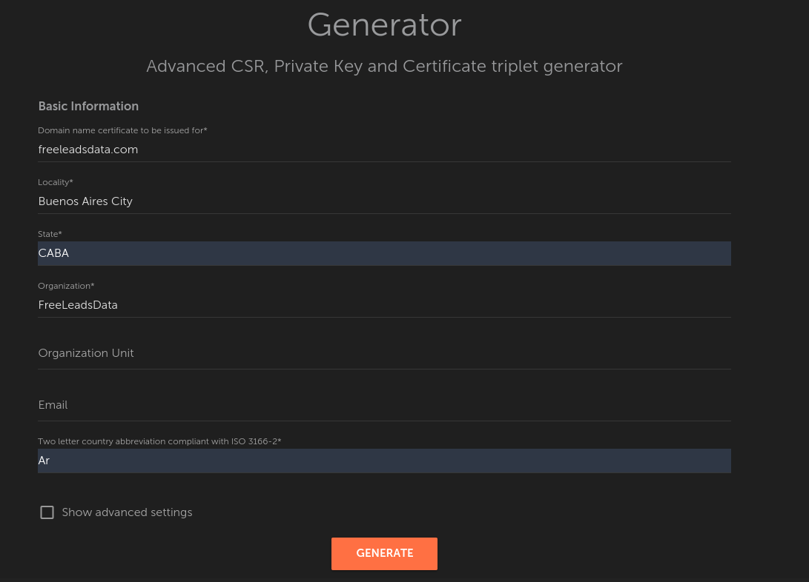
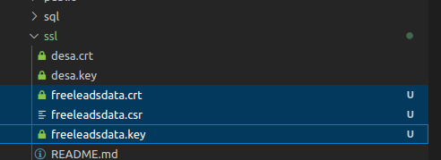
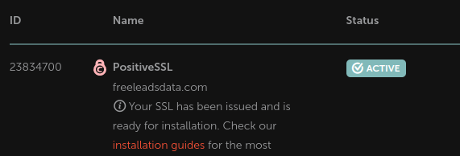
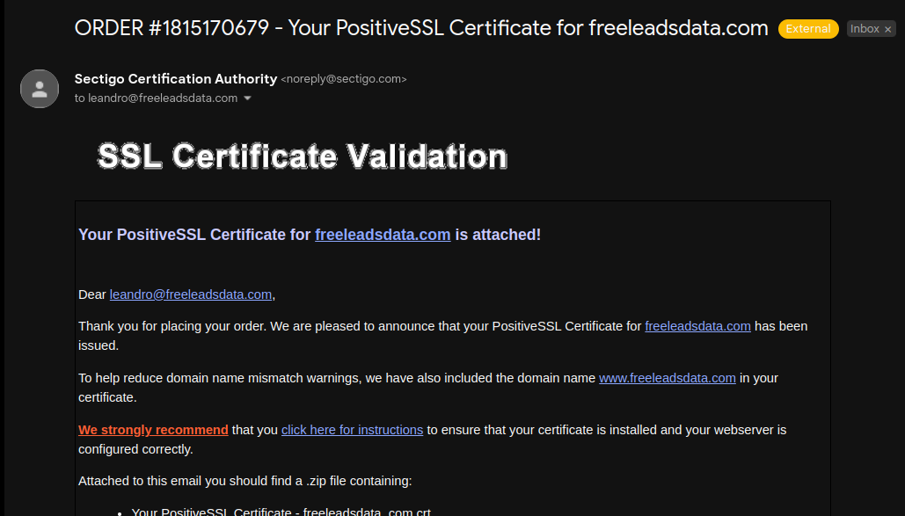
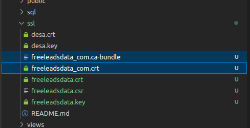

# SSL Certificates Installation and Reissuing

Before starting, you need to have a domain and email account under such a domain.
If you don't have them yet, refer to [this other tutorial](./01.setting-dimain-and-email) first.

If you already configured your domain and email account, here is a list of the different types of SSL certificates.

There are 3 technical types of SSL certificates we provide:

1. single-domain certificates – cover only 1 domain/subdomain name and its www subdomain;

2. multi-domain certificate – can secure three domain names for the original price. Overall, the certificate can secure up to 100 domain names (Please note that domain.com and www.domain.com are considered different domain names and need to be added separately.), 97 of them require additional payment;

3. wildcard certificates – can secure one domain name and all its one-level subdomains.

There is not an automated way to add domains to a multi-domain certificate. The process is manual, unfortunately.

Extra domains can be added only during the reissue process as is explained [here](https://www.namecheap.com/support/knowledgebase/article.aspx/9282/2221/can-i-add-another-domain-later-after-the-ssl-certificate-has-been-issued-and-activated).

## 1. Buying an SSL

Reference: [Steps to get the SSL certificate activated](https://www.namecheap.com/support/knowledgebase/article.aspx/794/67/how-do-i-activate-an-ssl-certificate/).

1. Access to your NameCheap account.

2. Go [here](https://www.namecheap.com/security/ssl-certificates/) and buy PositiveSSL for $5.99/year.

## 2. Creating Cerificates

1. Generate a CSR code for your domain. Use [this tool](https://decoder.link/csr_generator] for doing that.

2. Download 3 files: `yourdimain.csr`, `yourdomain.key` and `yourdomain.crt`, in the `/ssl` folder of your MySaaS project.

The .CRT is useless, because it is not trusted by browsers.
Instead, you should use the SSL certificate that you received from the Certificate Authority.

3. Go [here](https://ap.www.namecheap.com/ProductList/SslCertificates) to find the SSL cerificate that you just purchased.

4. Click on **Activate**, and follow the steps to verify you own the domain.

5. Go [here](https://ap.www.namecheap.com/ProductList/SslCertificates) again, and verify your new SSL is **active**.

And you will receive an email with the certificates to install in your website too.

6. Download the `.zip` file from the email, and extract the files in the `./ssl` folder of your MySaaS project.

## 3. Editing Certificates

CSR code is not needed for SSL installation. For installation on Nginx, you need to have end-entity and intermediate certificates bundled. You can paste your end-entity certificate into this tool: [https://decoder.link/result](https://decoder.link/result) then, scroll down to see the "Bundle (Nginx)" field.

* **End-entity certificate** is the one that issued for your domain name. This certificate was sent to you and has extension .crt. 

* **Intermediate certificates** are needed to create Trust Chain, they are sent to you in the .ca-bundle file.

Use this guide to install the certificates in Ngix:
[https://www.namecheap.com/support/knowledgebase/article.aspx/9419/33/installing-an-ssl-certificate-on-nginx/](https://www.namecheap.com/support/knowledgebase/article.aspx/9419/33/installing-an-ssl-certificate-on-nginx/)

Use this site to check if the which version of SSL certificate is installed:
[https://decoder.link/sslchecker/socialsellingmachine.com/443](https://decoder.link/sslchecker/socialsellingmachine.com/443)

Remember that both folders: $tempora/nginx and $tempora/ssl are replicated in the C: drive of each webserver.

Bundle CRT and Ca-Bundle files for NGINX. 

You need to have all the Certificates (your_domain.crt and your_domain.ca-bundle) combined in a single '.crt' file.

The Certificate for your domain should come first in the file, followed by the chain of Certificates (CA Bundle).

Download the SSL files from here:
https://ap.www.namecheap.com/ProductList/SslCertificates

Reference:
https://www.namecheap.com/support/knowledgebase/article.aspx/9419/33/installing-an-ssl-certificate-on-nginx/

## 4. Verification

Use this page to check if .crt and .key files match:
[https://www.sslshopper.com/certificate-key-matcher.html](https://www.sslshopper.com/certificate-key-matcher.html)

## 5. Re-Issuing Certificate

Reference: [NameCheap Tutorial: How to Renew SSL Certificate](https://www.namecheap.com/support/knowledgebase/article.aspx/816/2217/how-to-renew-an-ssl-certificate/)

1. Issue a new certificate as is explained in the first 2 steps of the section 2 (Creating Certificate)

2. Login to NameCheap

3. Find the list of active SSL Certificates [here](https://ap.www.namecheap.com/ProductList/SslCertificates).

4. Click on `renew`, and pay the order.

5. Find the new SSL certificate [here](https://ap.www.namecheap.com/ProductList/SslCertificates).

6. Click on `activate`. Follow the same steps than the section 2 (Creating Certificate)

