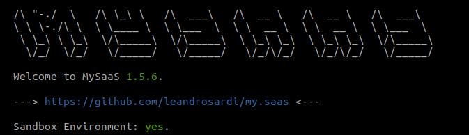
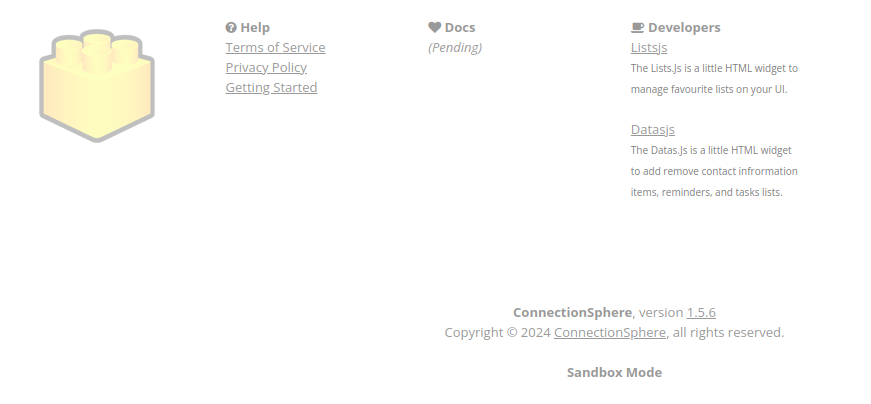

# Configurations

This tutorial explains all the sections you may find in the `config.rb` file.

**Outline:**

1. [Sandbox](#1-sandbox)
2. [Captcha](#2-captcha)
3. [Google Analytics](#3-google-analytics)
3. Funnel Setup
4. Debugging
5. Database Connection
6. API
7. Company Details
8. Default TimeZome
9. Transactional Emails
10. Deployment
11. Elastic Storage
12. Secret Files Management
13. Extensions
14. Invoicing and Payments Processing
15. Micro Services
16. [User Profiling](#16-user-profiling)
17. [Shadow Profiling](#17-shadow-profiling)


## 1. Sandbox

Create a file `.sandbox` to get the function `BlackStack.sandbox?` returning `true`.

```bash
cd ~/code/my.saas
touch .sandbox
```

The `BlackStack.sandbox?` function is used in the `config.rb` file mainly, switching configuration between `development` and `production` environments.

E.g.: You may want to switch between `development` and `production` databases without have to move files or writing code. Just keep the `.sandbox` file in your local computer for development.

```ruby
BlackStack::CRDB::set_db_params({ 
  :db_url => BlackStack.sandbox? ? '127.0.0.1' : '<serverless instance IP here>', 
  :db_port => '26257', 
  :db_cluster => BlackStack.sandbox? ? nil : '<serverless cluster ID here>', # this parameter is optional. Use this when using CRDB serverless.
  :db_name => 'freeleadsdata', 
  :db_user => 'root', 
  :db_password => '',
  :db_sslmode => BlackStack.sandbox? ? 'disable' : 'verify-full',
})
```

The state of the `.sanbox` flag is shown when you start the web server.



The state of the `.sandbox` flag is shown in the footer of the website too.



Note the `.sandbox` file is included in the [`.gitignore`](https://github.com/leandrosardi/my.saas/blob/main/.gitignore) file, so it will never be pushed into the repository accidentally. 

## 2. Captcha

_pending_

## 3. Google Analytics

_pending_

## 4. User Profiling

This feature is pending.
Refer to https://github.com/leandrosardi/my.saas/issues/12.

## 5. Shadow Profiling

This feature is pending.
Refer to https://github.com/leandrosardi/my.saas/issues/12.
